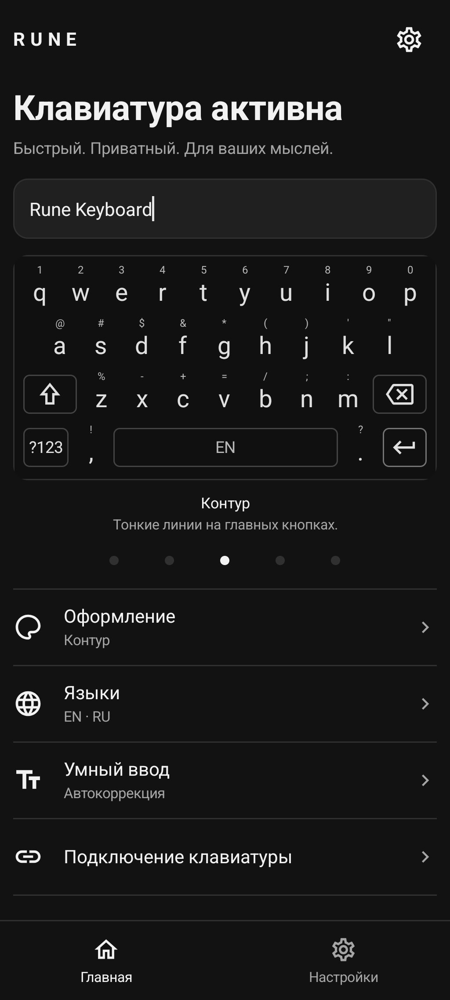
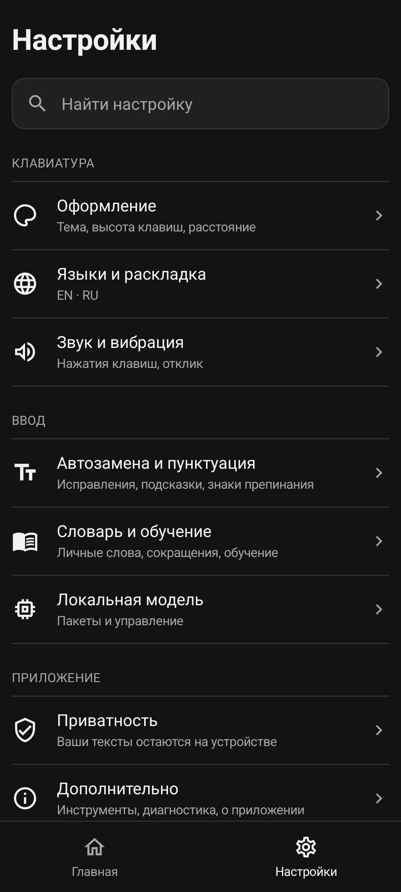
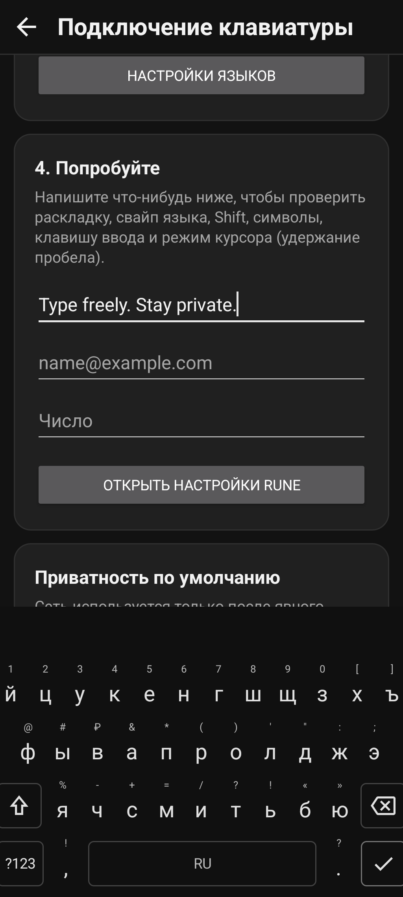

<div align="center">

# Rune Keyboard

**A quiet, private keyboard for Android.**

English · Русский · Español<br>
Five dark themes. Symbols with a downward flick. Typing stays on your device.

[Download APK](https://github.com/Mesteriis/rune.keyboard/releases/latest) · [User guide (RU)](docs/USER_GUIDE.ru.md) · [Report a bug](https://github.com/Mesteriis/rune.keyboard/issues) · [Contribute](CONTRIBUTING.md)

[](LICENSE)
[](#install)
[](https://github.com/Mesteriis/rune.keyboard/actions/workflows/ci.yml)

</div>

## Screenshots

<p align="center">
  
  
  
</p>

Captured on a Samsung Galaxy Z Fold7 cover screen. System bars and the edge-panel handle are cropped out; the app UI is unchanged. The text is a sample typed in Rune's own practice field.

## Features

- **Three languages:** English QWERTY, Russian ЙЦУКЕН and Spanish QWERTY with `ñ`.
- **Five monochrome themes:** Air, Soft, Outline, Monolith and Silent. Borderless letters, restrained action keys, adjustable height and spacing.
- **Downward key flicks:** enter the small symbol above a letter without opening the symbol layer. Numbers sit above the top row. Long-press still opens `ё`, accented letters and punctuation alternatives.
- **Spacebar gestures:** swipe sideways to change language; hold and drag to move the cursor; double-tap for a full stop.
- **Local typing tools:** suggestions, autocorrection, undo with Backspace, personal words, protected words and abbreviations.
- **Layouts that fit:** optional number row, number/phone/date fields, email/URL keys, portrait and landscape sizing, and foldable screen profiles.
- **Searchable settings:** a live keyboard preview, quick theme choices and grouped controls.
- **Optional local model:** explicitly download or import Rune Text for additional candidate scoring. Ordinary typing and dictionaries work without it.

Glide typing, an emoji panel, split/one-handed layouts and voice input are not implemented yet.

## Install

1. Download `rune-keyboard-0.4.2.apk` from [GitHub Releases](https://github.com/Mesteriis/rune.keyboard/releases/latest).
2. Open the APK and allow installation from that source when Android asks.
3. Open **Rune Keyboard → Set up keyboard**, enable Rune and select it as your keyboard.
4. Choose languages and try the practice field.

Requires **Android 8.0 (API 26) or newer**, with a **64-bit ARM or x86 processor** (`arm64-v8a` / `x86_64`). The APK contains both architectures.

Keep the same distribution/signing key when updating. Development debug builds and the public release use different keys; Android will not install one over the other. Export anything you need before choosing to remove an older debug installation.

**F-Droid:** packaging metadata and store descriptions are maintained in this repository. See [F-Droid submission and build notes](docs/FDROID.md) for the current status; an official listing is subject to F-Droid review.

## Gestures

| Action | Result |
| --- | --- |
| Tap a key | Type its letter |
| Flick down and release | Type its secondary number or symbol |
| Move back upward before release | Return to the letter |
| Long-press a letter | Choose an accented letter or `ё` |
| Swipe the spacebar left/right | Change language |
| Hold the spacebar, then drag | Move the cursor |
| Hold Backspace | Repeat deletion |

Key flicks can be disabled in **Settings → Appearance → Swipe down for symbols**. Keyboard themes and the app's light/dark setting are separate.

## Privacy

Rune has no ads or analytics SDKs. Text is processed locally. The only declared permission is `INTERNET`, used for an explicitly requested model download; the keyboard does not upload typing data. Model downloads are pinned to an immutable source and checked by size and SHA-256.

Personal dictionaries and enabled learning features can store data locally. The home preview does not feed learning. Model scoring runs in a separate private process; basic input never waits for it. Debug-only diagnostic recording is opt-in and excluded from release builds.

See [Privacy](PRIVACY.md) for storage, exports and deletion details.

## Build from source

Use **JDK 17**, Android SDK **37**, Build Tools **36.0.0**, NDK **29.0.14206865**, and CMake **3.31.6**. The checked-in Gradle wrapper pins the Gradle version; no global Gradle install is required.

```sh
git clone --recurse-submodules https://github.com/Mesteriis/rune.keyboard.git
cd rune.keyboard

# Set JAVA_HOME and ANDROID_HOME for your installation.
sdkmanager 'platforms;android-37' 'build-tools;36.0.0' \
  'ndk;29.0.14206865' 'cmake;3.31.6'
./gradlew assembleDebug
```

The development APK is `app/build/outputs/apk/debug/app-debug.apk`.

```sh
./gradlew testDebugUnitTest lint assembleRelease assembleProfile \
  privacyGateRelease privacyGateProfile imeIntelligenceBoundary \
  forbiddenRuntimeDependencies :runtime-llama:nativeSymbolGate
```

Release signing is local and optional for compilation: without signing configuration, `assembleRelease` produces an **unsigned** APK. Follow [Release instructions](docs/RELEASE.md) to produce an installable release. Do not publish a debug build as a production release.

Bundled dictionaries and small experimental model weights have pinned provenance and rebuild tools; normal Gradle builds use the committed assets. The large optional Rune Text model is downloaded separately and is not bundled in the APK.

## Project layout

| Path | Purpose |
| --- | --- |
| `app/` | Native Kotlin IME, keyboard views, settings, local typing tools and tests |
| `runtime-llama/` | JNI adapter and pinned llama.cpp submodule |
| `tools/` | Boundary checks, dictionary/model pipelines and evaluation tools |
| `docs/` | Architecture, build/release instructions and acceptance evidence |
| `fastlane/metadata/android/` | Localized store descriptions, changelogs and screenshots |
| `fdroid/` | Proposed F-Droid build recipe |

## Contributing

Bug reports, translations, accessibility improvements and focused patches are welcome. Include your Android version, screen configuration and reproducible steps, using sample text instead of private messages. Read [CONTRIBUTING.md](CONTRIBUTING.md) before opening a pull request.

Useful references: [architecture](docs/ARCHITECTURE.md), [acceptance checks](docs/ACCEPTANCE.md), [changelog](CHANGELOG.md), [detailed Russian guide](docs/USER_GUIDE.ru.md).

## License and credits

Rune's original code and documentation are licensed under the **[MIT License](LICENSE)**.

Third-party components retain their own licenses. These include llama.cpp (MIT), Material icons (Apache-2.0), and dictionaries, frequency data and experimental weights under their respective licenses. See [THIRD_PARTY_NOTICES.md](THIRD_PARTY_NOTICES.md); MIT does not relicense those assets.
